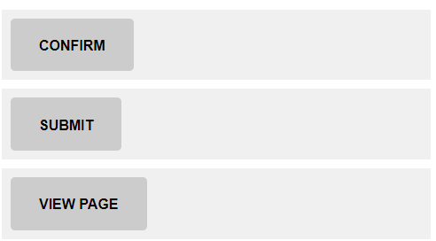

# BEM Button

This excersise demostrates re-using a generic BEM block across multiple HTML tags. 

## Task 1

Style the buttons in `index.html` to match the image.

### Additional styling
- Change the curser to the finger pointer when it is over the button using the `cursor` css property.
- Make sure when tabbing between the buttons, there is indication of which button is focussed.
- the colours used are background and text are `#ccc` (grey) and `#000` (black).

### Steps

1. add a button class to each of the HTML clickable elements.
1. in main.css, style the button class to make all the HTML elements appear as buttons.

# Answer

Once completed, checkout the `answer` branch to **compare your answer** to the working code.